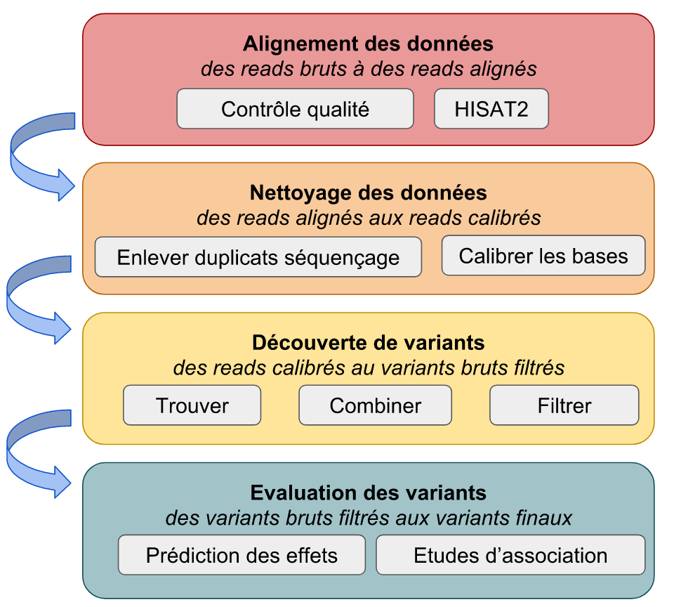
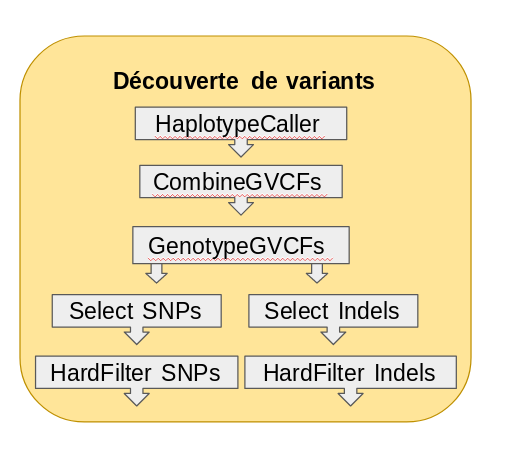

* * * * *

```{r setup, include=FALSE}
knitr::opts_chunk$set(echo = TRUE)
```

# Liste des nécessités pour faire fonctionner les scripts

Il est nécessaire d'avoir les logiciels suivants : gatk.jar, cromwell.jar et wdltool.jar. Pour les faire tourner il est également nécessaire d'avoir Java 8. Cromwell a besoin d'1 fichier config pour tourner correctement.

# Pré-requis

Pour obtenir les fichiers d'index des fichiers bam, il est nécessaire d'installer la suite d'outils Samtools. Il faut ensuite taper la commande suivante dans un terminal, là où se situe les fichier bam : $ samtools index fichier.bam fichier.bam.bai .

Pour écrire le fichier d'input au format texte, il faut taper le nom de l'individus (ou de l'échantillon) puis faire tab puis taper le chemin d'accès du fichier bam puis faire tab puis taper le chemin d'accès du fichier bam.bai en faisant un individu par ligne.

# Important

Changer les mails dans le début du script sge.

# Les données

Les données proviennent d'un séquençage suivi d'un alignement sur le génome qui produit des fichiers bam.

# Les scripts : Pipeline de génotypage

Ce pipeline est décomposé en 4 phases distinctes qui utilisent différentes resources et qui permettent de faire de la parallèlisation pour optimiser les temps de calculs. Ces 4 phases sont les suivantes :    
* Alignement des données (réalisé par l'équipe de la plateforme MBB);   
* Nettoyage des données;    
* Découverte des variants;   
* Evaluation des variants.    



Ce pipeline est une collection de script wdl, bash et json à exécuter dans l'ordre sur une machine Linux avec une gestion des jobs de type gridengine comme un cluster de calcul. Il est également exécutable sur une machine Linux sans gestion des jobs tels qu'une station de travail.

Pour rendre les données analysables pour la découverte de variants quelques étapes des phases précédentes nécessaires sont détaillées ci-après. 

Il existe un script qui lance les jobs sur le cluster mbb. "LancerScript.sge"

## Data Pre-processing : Nettoyage des données

### Lancement du script

Enlever le # avant la ligne contenant java . Enregister. Taper dans le terminal : qsub LancerScript.sge

### Explications

Le nettoyage des données est une phase nécessaire pour pouvoir réaliser la suite des analyses. En effet, elle permet d'obtenir des reads calibrés nécessaire à la phase 3. Cette phase comprend des étapes réalisées par Picard ou par GATK. 
    

La première étape de cette phase  appelée "ReorderSam" est réalisée par Picard. Cette étape range les reads en fonction de leur appartenance à un groupe de liaison dans l'ordre des contigs du génome de référence. En effet, si les contigs ne sont pas rangés dans le même ordre cela pose problème à GATK. C'est pour pallier à ce problème que l'on réalise cette étape. Elle est notamment nécessaire lorsque l'alignement a utilisé un ordre différents des groupes de liaisons.

La seconde étape nommée "Markduplicates" utilise Picard. Cette étape est importante car elle marque puis élimine les duplicats de séquençage. Ces duplicas sont des artéfacts dû à la PCR d'enrichissement des banques qui est réalisée en amont du séquençage. Ils sont retirés pour éviter que ces reads soient considérés comme des morceaux de transcrits plus représentés que d'autres.

La troisième étape intitulée "SortSam" est également réalisée par Picard. Cette étape range de nouveau les reads car certains ont été supprimés (masqués) par l'étape précédente. Cela permet d eles mettre en fin de fichier pour ne pas qu'il soit pris en compte dans l'étape qui suit.

Les deux étapes qui vont suivre sont nécessaires car les algorithmes de découverte de variants utilisent la qualité des bases de chaque reads pour déterminer s'il s'agit bel et bien d'une variation ou d'un artéfact. En effet, les scores de qualité sont dépendants du nombre de reads présents. Or certains reads considérés comme des duplicats de séquençage ont été retirés. Il ne faut donc plus les prendre en compte. D'autre part, à ces scores de qualité sont appliqués des erreurs systématiques qui  doivent être recalibrés. POur faire cela GATK utilise un algorithmle de "machine-learning" pour modeller empiriquement ces erreurs et ajuster les scores de qualité. Ces deux étapes sont "BaseRecalibrator"et "ApplyBQSR". La première est réalisée 2 fois afin de visualiser l'efficacité de la recalibration des reads.  Cette étape crée une table qui sera utilisée pour la recalibration. La seconde ("ApplyBQSR") utilise donc la table de recalibration produite par l'étape précédente pour effectuer la recalibration de chacune des bases de chaque reads.

La dernière étape nommée "AnalyzeCovariates" eégalement effectuée par GATK, produit des graphiques montrant l'efficacité de cette recalibration.

## Data Variant Calling : Découverte de variants

### Lancement du script


### Explications

Cette phase est entièrement réalisée par GATK et est la phase clé puisque c'est elle qui extrait les génotypes de chacun des individus. Le succès de cette phase dépend à la fois de la minimisation des Faux positifs et à la fois des Faux négatifs. POur faire cela, GATK procède en plusieurs étapes: la découverte de variants (étape "HaplotypeCaller") par individus, la fusion des génotypes de chaque individus (étapes "CombineGVCFs" et "GenotypeGVCFs") par lignée puis la filtration des variants par type de variations (SNPs ou INDELs). Les deux premières étapes ont été designés pour maximiser la sensibilité alors que la filtration permet de maximiser la spécificité par un choix de filtre adaptables à chaque jeu de données. Bien entendu, la découverte de variants dépends du type de données (Whole genome, transcriptome, exome, etc.) mais aussi de d'autres paramètres provenant du séquençage comme la couverture ou la profondeur de séquençage.


La première étape "HaplotypeCaller" réalise en même temps la recherche de SNPs et d'INDELs par un ré-assemblage *de novo* des haplotypes des séquences actives de la région ciblée. Cet outils est capable de détecter 5 types de variations différentes. [Source1](https://software.broadinstitute.org/gatk/documentation/article?id=3682) Il s'agit des SNPs, MNPs, INDELs, Mixed, et Symbolic. Les SNPs représentent des "single nucleotide polymorphism". Les MNPs représentent les "multi-nucleotide polymorphism". Les INDELs représentent des évènements d'insertions ou de délétions de nucléotides. Les Mixed représentent une combinaison de SNPs et d'INDELs à une seule et même position. Les Symbolic montrent qu'il se passe quelque chose à cette position mais qu'on ne sait pas exactement ce qu'il représente. Parfois, HaplotypeCaller utilise l'allèle "non ref" ou * pour signifier la présence d'une suppression étendue ou des évènements indéfinis comme un trés grand allèle, la perte d'un seul allèle, la perte de deux allèles, etc. [Source 2](https://software.broadinstitute.org/gatk/documentation/article.php?id=6926) HaplotypeCaller produit un fichier au format gVCF (Variant Calling Format) pour chaque individus.

La seconde étape "CombineGVCFs" combine en un seul fichier VCF tous les gVCFs produits dans l'étape précédente.

La troisième étape "GenotypeGVCFs" utilise le fichier VCF de tous les gVCFs combinés de chaque individus pour faire un recalibrage des scores de qualité des variants. Cette analyse réalisée par lignée permet la détection de variants au niveau des locus complexes. Il s'agit d'une aggrégation conjointe multi-échantillons qui fusionnent les enregistrement de manière sophistiquée : pour chaque position du fichier VCF (gVCFs combinés), cet outils combinent tous les enregistrment couvrant le même position, produit des probabilités de génotype correct, re-génotype l'enregistrement nouvellement fusionné puis le ré-annote.

La quatrième étape "SelectSNPs" ou "SelectINDELs" est la sélection des variations selon leur type (SNPs ou INDELs). Cette étape va permettre de séparer les variants afin de leur appliquer des filtres.

La cinquième étape "hardfilterSNPs" ou "hardfilterINDELs" est l'application de filtres.En effet, selon les bonnes pratiques de découverte de Variants à partir de données de RNA-seq, il faut réaliser un "hard-filtering". C'est-à-dire choisir des valeurs seuils qui définissent quelles données sont considérées comme correcte de celles qui ne le sont pas. Pour cela, ils recommandent différentes valeurs pour différents champs en fonction du type de variation (SNPs ou Indels). Ces valeurs sont présentées dans le tableau suivant :

| Sigle du champs utilisé | Valeur si SNPs | Valeur si INDELs |
| :---------------------: | :------------: | :--------------: |
| QD | <2.0 | <2.0 |
| FS | >60.0 | >200.0 |
| SOR | >3.0 | >10.0 |
| ReadPosRankSum | <-8.0 | <20.0 |
| MQ | <40.0 |   |
| MQRankSum | <-12.5 |   |
| InbreedingCoeff |   | <-0.8 |

Ces différents sigles représentent différentes annotation qui signifient :

+ **Quality by depth (QD)** :  Cette annotation met en perspective le score QUAL de la variante en la normalisant pour la quantité de couverture disponible. Parce que chaque lecture contribue un peu au score QUAL, les variantes dans les régions avec une couverture profonde peuvent avoir des scores QUAL artificiellement gonflés, donnant l'impression que l'appel est soutenu par plus de preuves qu'il ne l'est réellement. Pour compenser cela, nous normalisons la confiance de la variante par la profondeur, ce qui nous donne une image plus objective de la qualité de l'appel.    
+ **Fischer's Strand bias (FS)** : Le biais de brin est un type de biais de séquençage dans lequel un brin d'ADN est favorisé par rapport à l'autre, ce qui peut entraîner une évaluation incorrecte de la quantité de preuve observée pour un allèle par rapport à l'autre. L'annotation FisherStrand est l'une de plusieurs méthodes qui vise à évaluer s'il y a un biais de brin dans les données. Il utilise le test exact de Fisher pour déterminer s'il existe un biais de brin entre les brins aller et retour pour l'allèle de référence ou l'allèle alternatif. La sortie est une valeur p de Phred. Plus la valeur de sortie est élevée, plus il y a de risque de biais. Plus de biais indique des faux positifs.    
+ **Strand Odds Ratio (SOR)** : C'est une autre façon d'estimer le biais de brin en utilisant un test similaire au test de rapport de cotes symétrique. SOR a été créé parce que FS tend à pénaliser les variantes qui se produisent aux extrémités des exons. Les lectures aux extrémités des exons tendent à n'être couvertes que par des lectures dans une direction et FS donne un mauvais score à ces variantes. SOR prendra en compte les ratios de lectures qui couvrent les deux allèles.    
+ **ReadPosRankSum Rank Sum Test for relative positioning of REF versus ALT alleles within reads (ReadPosRankSum)** : Cette annotation au niveau des variantes teste s'il existe des preuves de biais dans la position des allèles dans les lectures qui les supportent, entre les allèles de référence et les allèles alternatifs. Voir un allèle seulement près des extrémités des lectures indique une erreur, car c'est là que les séquenceurs ont tendance à faire le plus d'erreurs. Cependant, certaines variantes situées près des bords des régions séquencées seront nécessairement couvertes par les extrémités des lectures, donc nous ne pouvons pas simplement définir un seuil absolu de «distance minimale à partir de la fin de la lecture». C'est pourquoi nous utilisons un test de somme de rang pour évaluer s'il y a une différence dans la façon dont l'allèle de référence et l'allèle alternatif sont supportés. Le résultat idéal est une valeur proche de zéro, ce qui indique qu'il y a peu ou pas de différence dans la localisation des allèles par rapport à la fin des lectures. Une valeur négative indique que l'allèle alternatif se trouve aux extrémités des lectures plus souvent que l'allèle de référence. Inversement, une valeur positive indique que l'allèle de référence se trouve plus souvent à l'extrémité des lectures que l'allèle alternatif.    
+ **Root Mean Square of the mapping quality of reads across all samples (MQ)** : Cette annotation fournit une estimation de la qualité de mappage globale des lectures prenant en charge un appel de variante. Il produit à la fois des données brutes (somme des carrés et nombre de lectures totales) et le carré moyen calculé. Les données brutes sont utilisées pour calculer avec précision le carré moyen en combinant plus d'un échantillon.   
+ **MappingQualityRankSum Rank Sum Test for mapping qualities of REF versus ALT reads (MQRankSum)**: Cette annotation au niveau des variants compare les qualités de cartographie des lectures supportant l'allèle de référence avec celles supportant l'allèle alternatif. Le résultat idéal est une valeur proche de zéro, ce qui indique qu'il y a peu ou pas de différence. Une valeur négative indique que les lectures supportant l'allèle alternatif ont des scores de qualité de cartographie inférieurs à ceux supportant l'allèle de référence. Inversement, une valeur positive indique que les lectures supportant l'allèle alternatif ont des scores de qualité de cartographie plus élevés que ceux supportant l'allèle de référence. Cette annotation peut être utilisée pour évaluer la confiance dans un appel de variante et est une covariable recommandée pour le recalibrage de variante (VQSR). Trouver une différence de qualité statistiquement significative suggère que le processus de séquençage et / ou de cartographie peut avoir été biaisé ou affecté par un artefact. En pratique, nous ne filtrons que les valeurs négatives faibles lors de l'évaluation de la qualité des variants car l'idée est de filtrer les variants pour lesquels la qualité des données supportant l'allèle alternatif est relativement faible. Le cas inverse, où c'est la qualité des données supportant l'allèle de référence qui est le plus bas (résultant en des scores de rangs positifs), n'est pas vraiment informatif pour les variantes de filtrage.  
+ **Inbreeding Coefficient (InbreedingCoeff)**: Cette annotation évalue s'il existe des preuves de consanguinité dans une population. Plus le score est élevé, plus le risque de consanguinité est élevé. Le calcul est une généralisation continue du test de Hardy-Weinberg pour le déséquilibre qui fonctionne bien avec une couverture limitée par échantillon. La sortie est la statistique F de l'exécution du test HW pour le déséquilibre avec les valeurs PL.